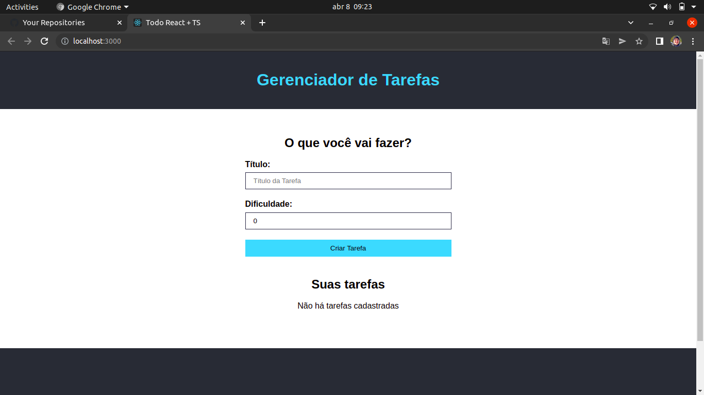
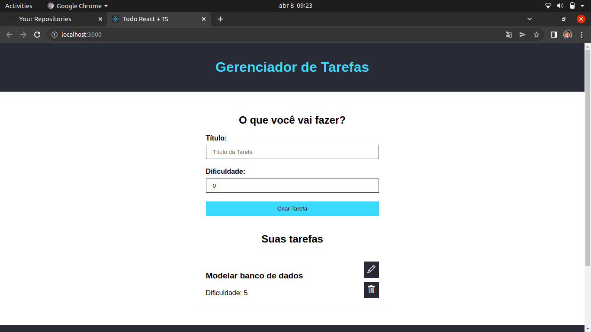
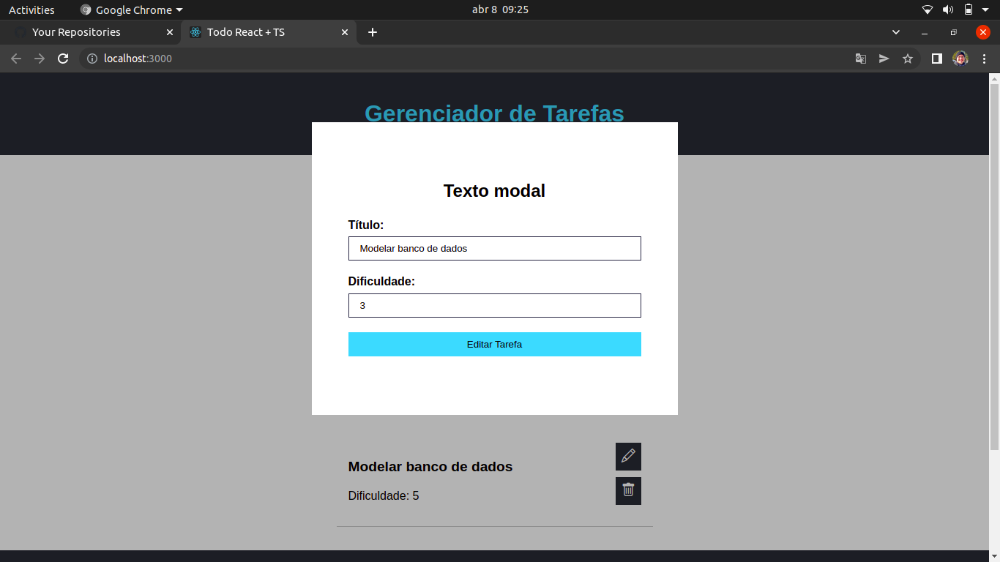

# React + Typescript Task Manager

>This a simple task manager implemented using React and Typescript. The use can add tasks and also include a level of difficulty to it. 
>It doesn't have connection to database once the ideia here was to understand better how to build React elements using Typescript.

## Technologies used:
 - React
 - Typescript
 
## Images of the project:

